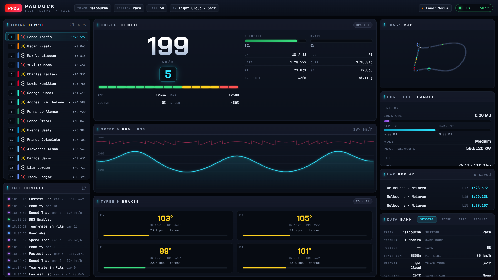

# F1 25 · Paddock

A paddock-wall style web dashboard for **F1 25**. It captures the game's live
UDP telemetry stream and shows everything in one browser window: live driver
cockpit, full-car timing tower, tyre temps/wear, ERS & damage, a track map with
live car positions, rolling speed/RPM charts, a race-control event feed, and a
saved-lap replay viewer — all in a dark broadcast-style "pit wall" theme.



*The wall mid-race: timing tower, driver cockpit, 60-second speed/RPM trace,
per-corner tyres, learned track map, ERS/fuel/damage meters, race-control feed,
saved-lap replay and the session data bank.*

## What you get

| Panel | Shows |
| --- | --- |
| **Timing Tower** | Live position, gap-to-leader, tyre compound badge (S/M/H in sidewall colours), PIT/DNF flags for every car. Click a row to focus the dashboard on that car. |
| **Driver Cockpit** | Big speed, glowing gear indicator, 15-LED RPM bar, throttle/brake bars, lap + sector times, fuel, DRS state. |
| **Speed & RPM** | Rolling 60-second speed (cyan area trace) + RPM (magenta) on canvas. |
| **Tyres & Brakes** | Per-corner surface/inner temps (colour-coded), pressure (PSI), wear bar, brake temp, driving surface (tarmac/grass/etc.). |
| **ERS · Fuel · Damage** | Battery store/deploy/harvest meters, fuel remaining, and the full damage matrix (wings, floor, gearbox, engine wear, DRS/ERS faults). |
| **Track Map** | Learns the circuit outline from your first lap, then plots every car's live position. Marshal zones light up yellow/blue. |
| **Race Control** | Decoded event feed with colour-coded severity dots: fastest lap, penalties, safety car, overtakes, retirements, start lights, etc. |
| **Lap Replay** | Every lap you complete is saved to disk. Click to open a speed/throttle/brake trace for any lap. |
| **Data Bank** | Tabbed: full session info + weather forecast, complete car setup, participant grid, final classification. |

All 16 F1 25 packet types are parsed (Motion, Session, LapData, Event,
Participants, CarSetups, CarTelemetry, CarStatus, FinalClassification,
LobbyInfo, CarDamage, SessionHistory, TyreSets, MotionEx, TimeTrial,
LapPositions).

---

## 1. Enable F1 25 telemetry (one-time)

In the game: **Options → Settings → Telemetry / UDP Settings**

- **UDP Telemetry:** On
- **UDP IP Address:** `127.0.0.1` (this PC) — or the PC's LAN IP to view from another device
- **UDP Port:** `20777`
- **UDP Send Rate:** `20 Hz` (or up to 60 Hz)
- **UDP Format:** **2025**

> **Advanced:** you can also edit the file  
> `Documents\My Games\F1 25\hardwaresettings\hardware_settings_config.xml`  
> and set the `<udp .../>` tag attributes: `enabled="true" ip="127.0.0.1"
> port="20777" sendRate="20" format="2025"`. The game must be closed when you
> edit this file, or it will be overwritten.

---

## 2. Run the dashboard

Requires **Node.js 18+** (you have v22).

```bash
cd "D:\SteamLibrary\steamapps\common\F1 25\f1-25-paddock"

# install once
npm install

# build the frontend
npm run build

# start the server (UDP listener + web + WebSocket)
npm start
```

Then open **http://localhost:3000** in any browser. Start (or resume) a session
in F1 25 and the panels fill in within a second.

If port 3000 is taken by something else, the server automatically walks to the
next free port (3001, 3002, …) and prints the URL it chose. Set `HTTP_PORT` to
pin it explicitly.

> **Game updates / DLC:** season content updates for F1 25 (including 2026
> content) keep the same UDP format `2025`, so they work unchanged. If the
> game ever sends a different format — usually a wrong in-game setting — the
> dashboard shows a red `UDP FORMAT … SET 2025 IN GAME` warning in the top bar
> instead of failing silently.

### View from another device on your network

Point F1 25's UDP IP at this PC's LAN address, then open
`http://<this-pc-ip>:3000` from a phone/tablet. Optionally set the port:

```bash
# defaults: HTTP 3000, UDP 20777
HTTP_PORT=8080 F1_UDP_PORT=20777 npm start
```

### Development mode (hot-reloading frontend)

```bash
npm run dev
```

This runs Vite on `:5173` and the backend on `:3000` together. Open
`http://localhost:5173` — Vite proxies `/ws` and `/api` to the backend, so
live telemetry works in dev too. If you move the backend (`HTTP_PORT=3210
npm run dev`), the proxy follows automatically.

---

## How it works

```
F1 25  ──UDP 20777──▶  Node backend (server/index.js)
                         ├── parser.js   parses raw little-endian packets
                         ├── records completed laps to recordings/
                         └── broadcasts JSON over WebSocket /ws
                                              │
                          Browser (src/) ◀────┘
                           store.js  merges packets, re-renders panels
```

- High-frequency packets (motion/telemetry/status) are throttled to 30/30/10 Hz
  before being sent to the browser, so the UI stays responsive even at 60 Hz game
  output.
- The browser additionally caps full re-renders at ~20 fps — panels rebuild
  their whole DOM per frame, so this keeps CPU flat without visible lag.
- A fresh browser connection immediately receives a **snapshot** of the latest of
  each packet type, so you don't stare at an empty screen.
- Lap recordings land in `f1-25-paddock/recordings/*.json` and are listed in the
  Lap Replay panel. Delete files there to clear history.

---

## Troubleshooting

**"OFFLINE" or panels never fill in.**
- Confirm UDP is enabled in F1 25 and the format is **2025** (Settings → Telemetry).
- A red **UDP FORMAT … SET 2025 IN GAME** tag in the top bar means telemetry is
  arriving but with the wrong format setting — change it in-game and it clears
  by itself.
- Confirm nothing else is already bound to port 20777 (only one app can listen —
  the server exits with a clear message if it can't bind).
- If you changed the port, start the backend with `F1_UDP_PORT=<port> npm start`.
- Check `http://localhost:3000/health` (or whichever port the server printed) —
  it should return `{"ok":true,...,"format":"2025"}`.

**Values look wrong / garbled.** Make sure **UDP Format = 2025** in-game. This
app implements the F1 25 spec; the 2023/2024 formats have different layouts and
are rejected with the top-bar warning rather than parsed as garbage.

**Track map is blank.** It traces the circuit from your car's world position
over the first lap. Drive a full lap and it will appear.

---

## Project layout

```
f1-25-paddock/
├── server/
│   ├── index.js        UDP listener + WebSocket + HTTP + lap recorder
│   └── parser.js       binary parser for all 16 packet types
├── shared/
│   └── enums.js        track/team/driver/tyre/weather lookup tables
├── src/
│   ├── main.js         wires the store to every panel
│   ├── styles.css      pit-wall design system (palette, panels, meters, tags)
│   ├── lib/
│   │   ├── store.js    reactive state + WebSocket client + formatters
│   │   └── dom.js      tiny hyperscript builder
│   └── panels/         TopBar, TimingTower, Cockpit, Tyres, ErsDamage,
│                       TrackMap, SpeedChart, EventLog, History, InfoPanels
├── docs/               README assets (dashboard screenshot)
├── recordings/         saved laps (JSON)
├── index.html
├── vite.config.js
└── package.json
```

Built against the official F1 25 "Data Output" UDP specification. Telemetry
parsers are dual-use developer tooling for a game you own.
